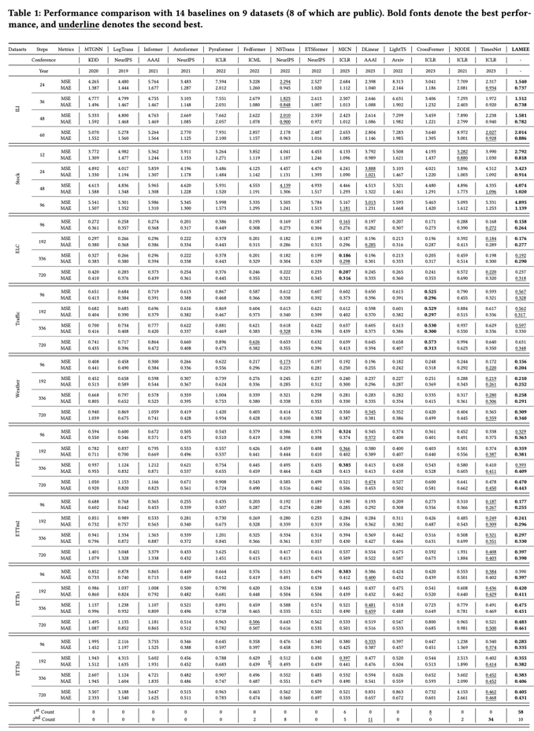

# Supplementary experiments

## Introduction

The anonymous repository is built for showing the supplementary experiments during the 
rebuttal and response period of paper "LAMEE: A Light All-MLP Framework Leveraging Joint Time-Frequency Information for 
Time Series Prediction" (paper id 191) in SIGKDD 2023.

Sperifically, we conduct three types of supplementary experiments:
> E1: Supplementary performance comparisons.

> E2: Supplementary effeciency comparisons.

> E3: A visualization for comparison between high-dimensional embeddings and raw features.

## Supplementary performance comparisons

We have utilized a fair third party benchmark that is publicly accessible ([link](https://github.com/thuml/Time-Series-Library)) to compare 14 influential time series forecasting 
studies that has been presented in recent years on 9 datasets (8 of which are public). We would like to express our sincere appreciation to the 
authors of this benchmark.

These compared studies are:
> 1. Connecting the Dots: Multivariate Time Series Forecasting with Graph Neural Networks. KDD, 2020. ([paper](https://dl.acm.org/doi/abs/10.1145/3394486.3403118)) ([code](https://github.com/nnzhan/MTGNN))

> 2. Enhancing the locality and breaking the memory bottleneck of transformer on time series forecasting. NeurIPS, 2019. ([paper](https://arxiv.org/pdf/1907.00235.pdf))

> 3. Neural Jump Ordinary Differential Equations: Consistent Continuous-Time Prediction and Filtering. ICLR, 2021. ([paper](https://arxiv.org/pdf/2006.04727.pdf)) ([code](https://github.com/HerreraKrachTeichmann/NJODE))

> 4. Informer: Beyond efficient transformer for long sequence time-series forecasting. AAAI, 2021. ([paper](https://ojs.aaai.org/index.php/AAAI/article/view/17325))

> 5. Autoformer: Decomposition transformers with auto-correlation for long-term series forecasting. NeurIPS, 2021.([paper](https://arxiv.org/pdf/2106.13008.pdf))

> 6. Pyraformer: Low-complexity pyramidal attention for long-range time series modeling and forecasting. ICLR, 2022. ([paper](https://openreview.net/forum?id=0EXmFzUn5I))

> 7. FEDformer: Frequency enhanced decomposed transformer for long-term series forecasting. ICML, 2022. ([paper](https://arxiv.org/pdf/2201.12740.pdf))

> 8. Non-stationary Transformers: Exploring the Stationarity in Time Series Forecasting. NeurIPS, 2022. ([paper](https://openreview.net/forum?id=ucNDIDRNjjv))

> 9. Etsformer: Exponential smoothing transformers for time-series forecasting. NeurIPS, 2022. ([paper](https://openreview.net/forum?id=5m_3whfo483))

> 10. MICN: Multi-scale Local and Global Context Modeling for Long-term Series Forecasting. ICLR, 2023. ([paper](https://openreview.net/forum?id=zt53IDUR1U))

> 11. Are Transformers Effective for Time Series Forecasting? AAAI, 2023. ([paper](https://arxiv.org/abs/2205.13504))

> 12. Crossformer: Transformer utilizing cross-dimension dependency for multivariate time series forecasting. ICLR, 2023. ([paper](https://openreview.net/forum?id=vSVLM2j9eie))

> 13. Less is more: Fast multivariate time series forecasting with light sampling-oriented mlp structures. Arxiv, 2022. ([paper](https://arxiv.org/abs/2207.01186))

> 14. TimesNet: Temporal 2D-Variation Modeling for General Time Series Analysis. ICLR, 2023. ([paper](https://openreview.net/forum?id=ju_Uqw384Oq))

These studies include Transformer based methods (2, 4, 5, 6, 7, 8, 9,and 12), convolutional neural networks based methods (1, 10, and 14), 
neural ordinary differential equations based method (3), and multi-layer perceptron based methods (11 and 13).
We have rewritten the code of 1 and 3 to perform our experiments, the rest of the code is taken directly from this benchmark.

These experiments are conducted on 9 datasets: illness, stock (not public for now), electricity, traffic, weather, ETT series (contains 4 datasets). 
These datasets can be directly obtained in ([BaiduCloud](https://pan.baidu.com/s/1r3KhGd0Q9PJIUZdfEYoymg?pwd=i9iy)).

The detailed performance comparison:

Higher resolution image please see ([results](./performance.pdf))

## Supplementary efficiency comparisons

 
