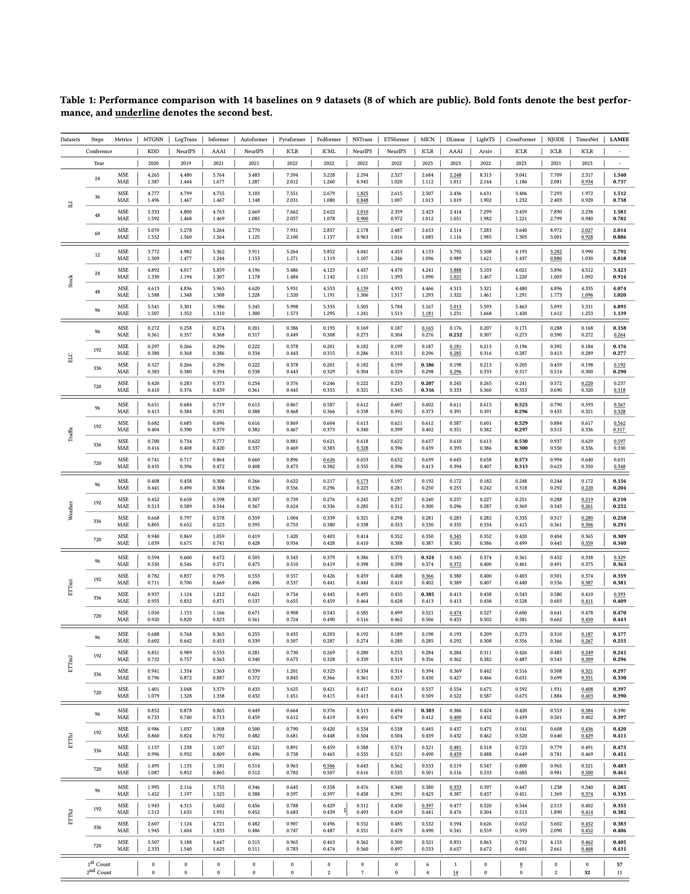
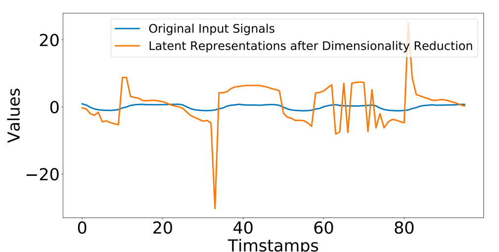

# Supplementary experiments

## 1. Introduction

We have created an anonymous repository specifically designed to showcase 
supplementary experiments during the rebuttal and response period for the paper 
titled 'LAMEE: A Light All-MLP Framework Leveraging Joint Time-Frequency Information for 
Time Series Prediction' (paper ID 191) in SIGKDD 2023.

The supplementary experiments can be classified into three types:
> E1: Supplementary performance comparisons.

> E2: Supplementary effeciency comparisons.

> E3: An example comparing de-noising methods. 

> E4: A visualization comparing high-dimensional embeddings and raw features

## 2. Supplementary performance comparisons

We have used a publicly available and fair third-party benchmark ([link](https://github.com/thuml/Time-Series-Library))
compare 14 significant time series forecasting studies that have been presented in 
recent years on nine datasets, out of which eight are public. We would like to extend 
our sincere appreciation to the authors of this benchmark for their invaluable contribution.

These compared studies are:
> 1. Connecting the Dots: Multivariate Time Series Forecasting with Graph Neural Networks. KDD, 2020. (MTGNN) ([paper](https://dl.acm.org/doi/abs/10.1145/3394486.3403118)) ([code](https://github.com/nnzhan/MTGNN))

> 2. Enhancing the locality and breaking the memory bottleneck of transformer on time series forecasting. NeurIPS, 2019. (LogTrans) ([paper](https://arxiv.org/pdf/1907.00235.pdf))

> 3. Neural Jump Ordinary Differential Equations: Consistent Continuous-Time Prediction and Filtering. ICLR, 2021. (NJODE) ([paper](https://arxiv.org/pdf/2006.04727.pdf)) ([code](https://github.com/HerreraKrachTeichmann/NJODE))

> 4. Informer: Beyond efficient transformer for long sequence time-series forecasting. AAAI, 2021. (Informer) ([paper](https://ojs.aaai.org/index.php/AAAI/article/view/17325))

> 5. Autoformer: Decomposition transformers with auto-correlation for long-term series forecasting. NeurIPS, 2021. (Autoformer) ([paper](https://arxiv.org/pdf/2106.13008.pdf))

> 6. Pyraformer: Low-complexity pyramidal attention for long-range time series modeling and forecasting. ICLR, 2022. (Pyraformer) ([paper](https://openreview.net/forum?id=0EXmFzUn5I))

> 7. FEDformer: Frequency enhanced decomposed transformer for long-term series forecasting. ICML, 2022. (Fedformer) ([paper](https://arxiv.org/pdf/2201.12740.pdf))

> 8. Non-stationary Transformers: Exploring the Stationarity in Time Series Forecasting. NeurIPS, 2022. (NSTrans) ([paper](https://openreview.net/forum?id=ucNDIDRNjjv))

> 9. Etsformer: Exponential smoothing transformers for time-series forecasting. NeurIPS, 2022. (ETSformer)  ([paper](https://openreview.net/forum?id=5m_3whfo483))

> 10. MICN: Multi-scale Local and Global Context Modeling for Long-term Series Forecasting. ICLR, 2023. (MICN) ([paper](https://openreview.net/forum?id=zt53IDUR1U))

> 11. Are Transformers Effective for Time Series Forecasting? AAAI, 2023. (DLinear) ([paper](https://arxiv.org/abs/2205.13504))

> 12. Crossformer: Transformer utilizing cross-dimension dependency for multivariate time series forecasting. ICLR, 2023. (Crossformer) ([paper](https://openreview.net/forum?id=vSVLM2j9eie))

> 13. Less is more: Fast multivariate time series forecasting with light sampling-oriented mlp structures. Arxiv, 2022. (LightTS) ([paper](https://arxiv.org/abs/2207.01186))

> 14. TimesNet: Temporal 2D-Variation Modeling for General Time Series Analysis. ICLR, 2023. (TimesNet) ([paper](https://openreview.net/forum?id=ju_Uqw384Oq))

The selected studies comprise Transformer-based methods (2, 4, 5, 6, 7, 8, 9, and 12), 
convolutional neural network-based methods (1, 10, and 14), neural ordinary differential 
equation-based methods (3), and multi-layer perceptron-based methods (11 and 13). 
For our experiments, we have rewritten the code of methods 1 and 3, while the remaining 
code has been taken directly from the benchmark.

We have conducted these experiments on a total of nine datasets, 
which include illness, electricity, traffic, weather, 
and the ETT series (which contains four datasets). 
While the stock dataset is not currently publicly available due to privacy and economic concerns, 
the remaining datasets can be obtained directly from 
([BaiduCloud](https://pan.baidu.com/s/1r3KhGd0Q9PJIUZdfEYoymg?pwd=i9iy)).

The detailed performance comparison:

## 3. Supplementary efficiency comparisons

In this section, we will compare the efficiency of our approach against several baselines, 
including Transformer-based methods (Informer, Autoformer, and Fedformer), 
MLP-based method (DLinear), and convolutional neural network-based methods (MICN and TimesNet).

We will specifically evaluate the efficiency comparisons based on the number of parameters 
(in millions), time consumption (in seconds per epoch), and memory usage (in GB). 
For brevity, we will refer to these metrics as # Para, TC, and MU, respectively.

The detailed performance comparison:

## 4. An example comparing de-noising methods.
In response to the Q1 of Reviewer ucRn, we give an example to compare the de-noising methods of traditional low-passing filtering and 
our proposed decomposition before low-passing filtering.

Specifically, we intercept a section signal with length of 180 from the electricity dataset, and
add Gaussian noises with a mean of 0 and a variance of 0.5 to the signal, shown as Fig (1). 
The Mean Absolute Errors between the noised signal and the original signal is 0.397, and the corresponded Pearson correlation between the 
both is 0.497. 

If we only use the traditional low-passing filtering to de-noise the noised signal, the Mean Absolute Errors between the  both is 0.200, and 
the Pearson correlation is 0.744, shown as Fig (2). If a time series decomposition operation can be performed firstly, and then only perform low-passing filtering 
on the seasonal term, as it do in our paper, the Mean Absolute Errors can be reduced to 0.105, and
the Pearson correlation can be enhanced to 0.820, shown as Fig (3). 

[//]: # (Higher resolution image please see &#40;[Link]&#40;./effeciency_comp.pdf&#41;&#41;)

## 5. A visualization comparing high-dimensional embeddings and raw features

In response to the Q1 of Reviewer ucRn, we conduct the visualization comparing the high-dimensional embeddings and raw features.

In this paper, we have used raw features directly instead of using high-dimensional embeddings. We have found that this strategy performs better than the latter, as shown in the performance comparison of the ablation model 'LAMEE (embeddings)' in Section 4.3.

This means that the feature dimension remains constant across the entire model, and the dimension of the latent space is equal to the feature dimension.

From a matrix theory perspective, we assume that performing high-dimensional embeddings can result in non-full rank latent representations in high-dimensional spaces, leading to information redundancy. We have conducted an experiment to illustrate this phenomenon.

Specifically, we have extracted the latent representations after the first projection in a well-trained Transformer model and used the TSNE dimensionality reduction algorithm to project the representations into a one-dimensional space. We have compared the sequence after dimensionality reduction with the original input sequence, and it is apparent that the sequence after dimensionality reduction seriously distorts the sequence of the original input, as shown below:

Please note that this is just an assumption based on the experimental phenomenon. In the future, we plan to focus more on this phenomenon and try to provide a more detailed explanation.